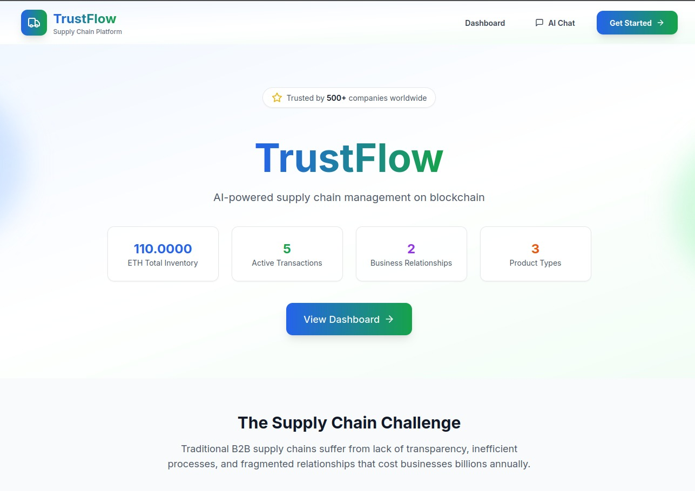
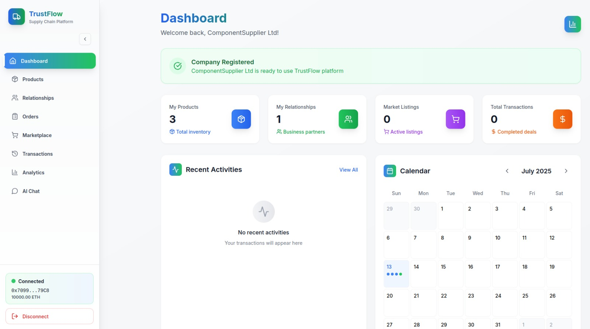
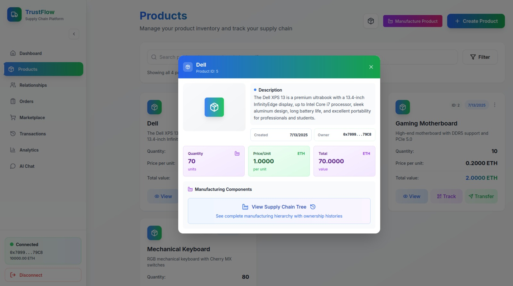
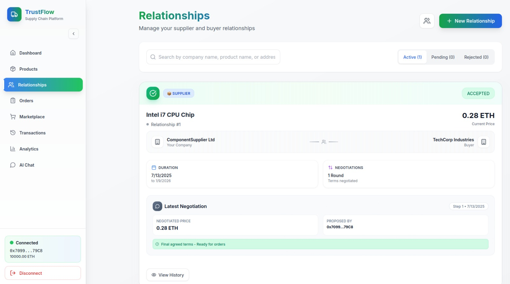
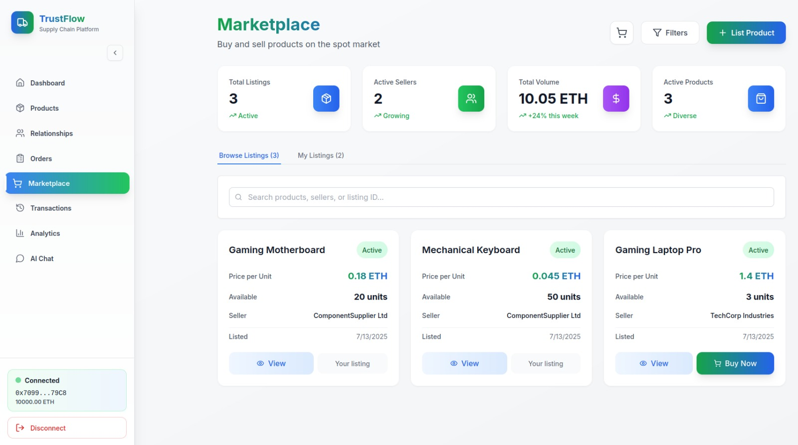
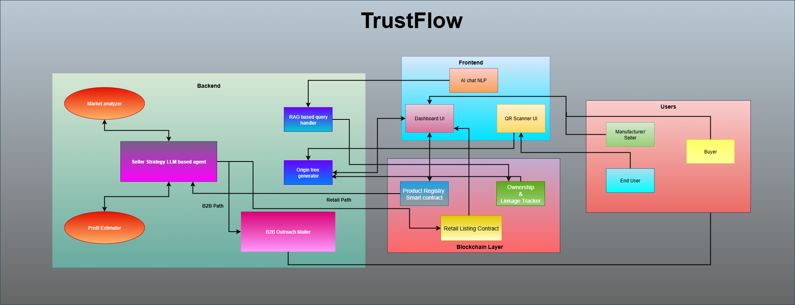
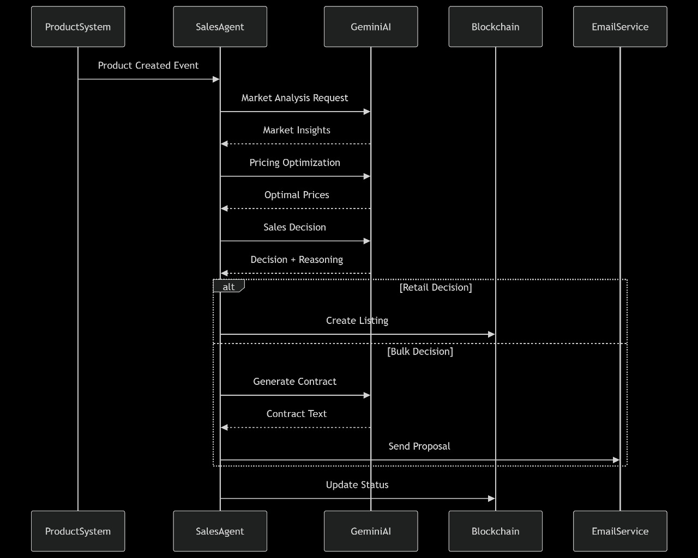

# TrustFlow - Agentic Supply Chain Management on Ethereum

[](https://soliditylang.org/)
[](https://nextjs.org/)
[](https://hardhat.org/)

## 📋 Table of Contents
- [Problem Statement](#-problem-statement)
- [Our Solution](#-our-solution)
- [Example Use Case](#-example-use-case-verified-smart-power-bank--made-in-india)
- [Live Demo](#-live-demo)
- [Features](#-features)
- [System Architecture](#-system-architecture)
- [Technology Stack](#-technology-stack)
- [Getting Started](#-getting-started)
- [Future Roadmap](#-future-roadmap)
- [Team](#-team)
- [Acknowledgments](#-acknowledgments)


## Problem Statement

In Today's global markets, product authenticity and traceability are becoming critical business differentiators — especially for industries dealing in high-value or safety-critical products like electronics, pharmaceuticals etc. However, most businesses cannot prove the full journey of their product, and trust is often broken between suppliers, buyers, and end consumers. Meanwhile, businesses struggle to scale operations efficiently, often missing optimal trade opportunities due to delayed decisions and lack of automation.

## Our Solution: Agentic SCM on Ethereum

We present a decentralized supply chain management platform powered by Ethereum blockchain and AI-driven agents — designed to offer trust, traceability, and automation at scale.

### ✅ Why Blockchain?
- Our platform uses Ethereum smart contracts to ensure:

- Tamper-proof product journey records: Every transaction, handoff, or quality verification is immutably recorded.

- Proof of Origin: Businesses using our platform receive a blockchain-certified product trail they can display to customers — boosting brand trust, just like "PETA certified" or "USDA Organic".

- Transparent compliance: Buyers can validate product claims (e.g., organic, ethical sourcing) independently.

- This enables businesses to capitalize on the rising demand for transparent sourcing. Our platform becomes a stamp of credibility — and we monetize it by charging certified sellers who wish to showcase their supply chain through our trusted infrastructure.

### 🤖 Why AI Agents?
We deploy autonomous Seller Strategy Agent that:

- Monitor the network for optimal trade opportunities.

- Analyze product history, price trends, and seller ratings.

- Automatically sells orders once conditions match.

- Help businesses operate at machine-level efficiency, minimizing human delay.

- This agentic automation empowers businesses to scale faster, make informed decisions, and tap into a dynamic ecosystem of verified partners — without manual oversight.

## Example Use Case: Verified Smart Power Bank – “Made in India”
- A customer buys a 20,000mAh power bank from a retailer. It has a QR code powered by our platform.
- The battery cells came from Panasonic India, batch ID #2231.
- The product was manufactured in India by a government-certified SME electronics unit.
- Each component and stage passed quality and temperature tests.
- The full journey — from supplier to assembly to retailer — is recorded on Ethereum, tamper-proof.

##  Screenshots







## Features

### Blockchain Features
- **Smart Contract Management**: Complete supply chain operations on Ethereum
- **Product Traceability**: End-to-end product journey tracking
- **Order Management**: QR Based Delivery tracking
- **Relationship Management**: Supplier-buyer relationship establishment
- **Marketplace Integration**: Spot market for immediate transactions

### AI Agent Features
- **Autonomous Trading**: Seller Strategy Agent helps seller to automatically sell his goods after doing market analysis.
- **Product Analysis**: Real-time trend and price analysis
- **Company Analysis**: AI generates detailed PDF review of the company 
- **AI Chat**: Agents integrated RAG based models to query the blockchain thorugh NLP. 

### Tracking & Monitoring
- **Real-time Order Tracking**: 6-stage delivery pipeline
- **OriginTree™ Scan**: QR-based product history showing full component lineage and ownership hierarchy
- **Payment Integration**: Secure payment processing via ETH or UPI

### Security & Trust
- **Immutable Records**: Tamper-proof transaction history
- **Role-based Access**: Secure permission management
- **Audit Trail**: Complete audit trail for all operations
- **Data Integrity**: Cryptographic verification of all data

## System Architecture



### AI Agent HLD


## Technology Stack

### Frontend
- **Next.js 14**: React framework with App Router
- **TypeScript**: Type-safe development
- **Tailwind CSS**: Utility-first CSS framework
- **Web3.js**: Ethereum blockchain integration
- **MetaMask**: Wallet connection

### Blockchain
- **Solidity 0.8.28**: Smart contract development
- **Hardhat**: Development environment
- **Ethereum**: Blockchain network

### AI/Backend
- **Gemini**: LLM for AI suggestions
- **Python**: Backend API development
- **FastAPI**: REST API framework

## Getting Started

### Prerequisites
- Node.js 18+ 
- Python 3.8+
- MetaMask browser extension
- Git

### Quick Start

1. **Clone the repository**
   ```bash
   git clone https://github.com/your-username/trustflow.git
   cd trustflow
   ```

2. **Blockchain Setup**
   ```bash
   cd blockchain
   npm install
   npx hardhat node
   ```

3. **Deploy Smart Contract**
   ```bash
   npx hardhat run scripts/deploy.js --network localhost
   ```

4. **Frontend Setup**
   ```bash
   cd frontend
   npm install
   npm run dev
   ```

5. **AI Backend Setup**
   ```bash
   # Install Ollama
   curl -fsSL https://ollama.com/install.sh | sh
   
   # Pull Mistral model
   ollama pull mistral:7b
   
   # Start Python backend
   cd backend
   python3 -m venv venv
   source venv/bin/activate
   pip install -r requirements.txt
   python3 app.py
   ```

### Configuration

1. **MetaMask Network Setup**:
   - Network Name: `localhost`
   - RPC URL: `http://127.0.0.1:8545/`
   - Chain ID: `31337`
   - Currency Symbol: `ETH`

2. **Contract Address**:
   - Update `frontend/lib/contract.ts` with deployed contract address

3. **Environment Variables**:
   ```env
   NEXT_PUBLIC_CONTRACT_ADDRESS=your_contract_address
   NEXT_PUBLIC_NETWORK_ID=31337
   ```

## 🔮 Future Roadmap

- 📋 Buyer and Negotiation AI Agents
- 📋 Advanced Inventory management
- 📋 IoT integration
- 📋 Android App support

## 👥 Team

- **Sagar Athani**
- **Praveen kumar**
- **Adya N A**
- **Abhay Singh Rajput**

## 🙏 Acknowledgments

- Agentic Ethereum India #AgenticHack


<div align="center">
  <p>Made with ❤️ for the Agentic Ethereum Hackathon India</p>
</div>


